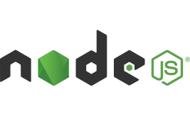

<h3 >
    
    Hi, I'm Deepak Kumar Bansal!
</h3>

I'm a final-year B.Tech (IT) student at **Chandigarh Group of Colleges, Landran**. I'm a passionate full-stack developer and a DSA enthusiast who enjoys building dynamic web applications and solving real-world problems through code.

---

## 🚀 About Me

- 🎓 Final-year IT student at CGC Landran
- 🌱 Currently learning:
  - Full-stack Web Development (MERN)
  - Data Structures & Algorithms in C++
- 💻 Working on personal and academic projects
- 🪟 Using Windows as my development environment
- 🔍 Exploring both frontend and backend technologies

## 🛠️ Tech Stack
           
**Languages**:    C++ | JavaScript | HTML | CSS

**Frameworks**:    React.js | Node.js | Express.js

**Databases**:     MongoDB|MySQL

**Tools**:         Git | VS Code | Windows | Postman | GitHub

## 📫 Connect with me

